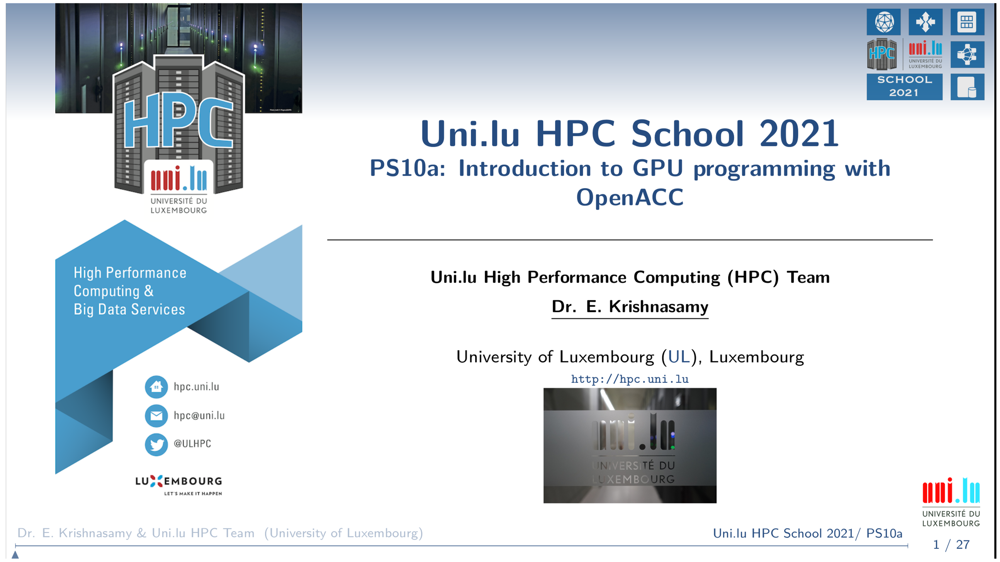
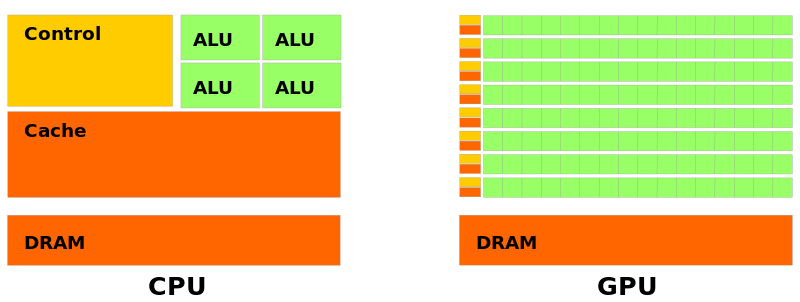
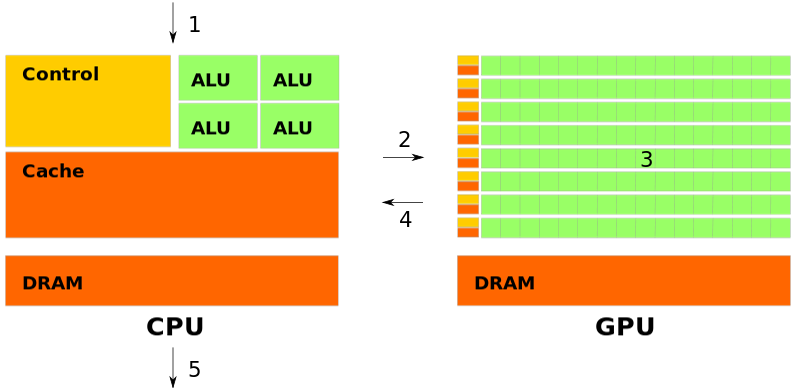
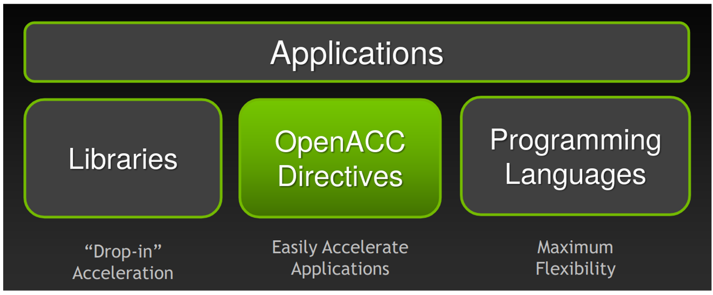

[](https://hpc.uni.lu) [](http://www.gnu.org/licenses/gpl-3.0.html) [](https://github.com/ULHPC/tutorials/issues/) [](https://github.com/ULHPC/tutorials/raw/devel/cuda/slides.pdf) [](https://github.com/ULHPC/tutorials/tree/devel/cuda/) [](http://ulhpc-tutorials.readthedocs.io/en/latest/cuda/) [](https://github.com/ULHPC/tutorials)

# Introduction to OpenACC Programming Model (C/C++ and Fortran)

     Copyright (c) E. Krishnasamy, 2013-2021 UL HPC Team <hpc-sysadmins@uni.lu>

[](./PS10a1.pdf)

# Objectives

* Understanding the [OpenACC programming model](https://www.openacc.org/)
* How to use some of the directives from OpenACC to parallelize the code
      - compute constructs, loop constructs, data clauses
* Implementing OpenACC parallel strategy in [C/C++](https://www.cprogramming.com/) and [FORTRAN](https://fortran-lang.org/) programming languages
* Simple [mathematical examples](https://www.netlib.org/blas/) to support and understand the OpenACC programming model 
* Finally to show how to run these examples using [Iris cluster (ULHPC)](https://hpc-docs.uni.lu/systems/iris/)
          - both [interactively](https://hpc-docs.uni.lu/jobs/interactive/) and using a [batch job script](https://hpc-docs.uni.lu/jobs/gpu/)

### Prerequisite:
* C/C++ and/or FORTRAN languages 
* OpenMP or some basic parallel programming concept (advantage not necessary)


### Important: PRACE MOOC

> ***NOTE***: this lecture is limited to just 45 min, it only covers very basic tutorial about OpenACC.
  To know more about (from basic to advanced) CUDA programming and OpenACC programming model,
  please refer to __PRACE MOOC__ ***GPU Programming for Scientific Computing and Beyond - Dr. Ezhilmathi Krishnasamy***
 

# Preparation 
#### Access the slides and exercises

* To keep the tutorial and hands on your local machine 

```
$> mkdir UHPC-School-2021
$> cd UHPC-School-2021
$> git clone https://github.com/ULHPC/tutorials
$> cd tutorials/gpu/openacc/OpenACC-Tutorial/exercises # for exercises
$> cd tutorials/gpu/openacc/OpenACC-Tutorial/ # for slides and README.md 
```

#### Connect to Iris cluster
```
$> ssh -X iris-cluster 
//or 
$>  ssh -p 8022 user@access-iris.uni.lu
```

#### Transfer the files(exercises) to Iris cluster 
```
$> rsync -avP --no-p --no-g -r exercises iris-cluster:/home/users/ekrishnasamy
// or 
$> rsync -avP --no-p --no-g -r exercises ekrishnasamy@access-iris.uni.lu:/home/users/ekrishnasamy
```

#### Reserve the compute node for exercises 
```
$> salloc --reservation=hpcschool-gpu -G 1 -n 4 -t 00:30:00
//or 
$> si-gpu
```

#### Load the OpenACC compiler (PGI) 

```
$> module spider pgi 
$> module load compiler/PGI/19.10-GCC-8.3.0-2.32
```

# Difference between CPU and GPU 
#### CPU vs GPU

* CPU frequency is higher compared to GPU
* But GPU can run many threads in parallel compared to CPU
* On the GPU, the cores are grouped and called "Streaming Multiprocessor - SM"
* Even on the Nvidia GPU, it has a "Tensor Process Unit - TPU" to handle the AI/ML
  computations in an optimized way
* GPU are based on the "Single Instruction Multiple Threads"
* Threads are executed in a group on the GPU, typically they have 32 threads.
  This is called "warps" on the Nividia GPU and "wavefronts" on the AMD GPU.


#### CPU vs GPU



#### Thread Hierarchy


#### How GPUs are used for computations

* Step 1: application preparation, initialize the memories on both CPU and GPU
* Step 2: transfer the data to GPU
* Step 3: do the computation on the GPU
* Step 4: transfer the data back to CPU
* Step 5: finalize the application and delete the memories on both CPU and GPU



# OpenACC
#### Few points about OpenACC 

* OpenACC is not GPU programming
* OpenACC is expressing the parallelism in your code
* OpenACC can be used in both Nvidia and AMD GPUs
* “OpenACC will enable programmers to easily develop portable applications that maximize 
  the performance and power efficiency benefits of the hybrid CPU/GPU architecture of 
  Titan.”
      - Buddy Bland, Titan Project Director, Oak Ridge National Lab
* “OpenACC is a technically impressive initiative brought together by members of the 
  OpenMP Working Group on Accelerators, as well as many others. We look forward to 
  releasing a version of this proposal in the next release of OpenMP.”
      - Michael Wong, CEO OpenMP Directives Board


#### Ways to accelerate applications on the GPU




#### Ways to accelerate applications on the GPU

* Libraries: easy to use with very limited knowledge with GPU programming
      - cuBLAS, cuFFT, CUDA Math Library, etc,.
* Directive based programming model: will accelerate the application 
  with using directives in the existing code
      - OpenACC and OpenMP (might be applicable in the future)
* Programming languages: low level programming languages that will
  further optimize the application on the accelerator
      - CUDA, OpenCL, etc,.


#### Compilers and directives (only few of them listed in here)

* OpenACC is supported by the Nvidia, [PGI](https://www.pgroup.com/index.htm), GCC, and [HPE Gray](https://buy.hpe.com/us/en/software/high-performance-computing-software/high-performance-computing-software/hpe-cray-programming-environment/p/1012707351) (only for FORTRAN) compilers
     - Now PGI is part of Nvidia, and it is available through [Nvidia HPC SDK](https://developer.nvidia.com/hpc-sdk)
* Compute directives:
     - parallel and kernel
* Loop directive:
     - loop
* Data management directives:
     - copyin and copyout
* Others:
     - reduction 

#### Basic programming structure 

~~~ c
// C/C++
#include "openacc.h"
#pragma acc <directive> [clauses [[,] clause] . . .] new-line
<code>
~~~

~~~ fortran 
!! Fortran
use openacc
!$acc <directive> [clauses [[,] clause] . . .]
<code>
~~~


# Compute directives in OpenACC
#### _kernels_ in C/C++

~~~ c
// Hello_World.c                    | // Hello_World_OpenACC.c           
void Print_Hello_World()            | void Print_Hello_World()            
{                                   | {
                                    | #pragma acc kernels
  for(int i = 0; i < 5; i++)        |    for(int i = 0; i < 5; i++)    
    {                               |      {
      printf("Hello World!\n");     |        printf("Hello World!\n"); 
    }                               |      }   
}                                   | }     
~~~


* compilation: ```pgcc -fast -Minfo=all -ta=tesla -acc Hello_World.c```
      - Compiler will give already much info, what do you see? 
      

```
$> pgcc -fast -Minfo=all -ta=tesla -acc Hello_World.c 
Print_Hello_World:
      6, Loop not vectorized/parallelized: contains call
main:
     14, Print_Hello_World inlined, size=4 (inline) file Hello_World.c (5)
           6, Loop not vectorized/parallelized: contains call
```
* Now add either _kernels_ or _parallel_ directives to vectorize/parallelize the loop
```
$> pgcc -fast -Minfo=all -ta=tesla -acc  Hello_World_OpenACC.c 

print_hello_world:
      6, Loop is parallelizable
         Generating Tesla code
          6, !$acc loop gang, vector(32) ! blockidx%x threadidx%x

```
* As we can see above the loop is vectorized!.


#### _kernels_ in FORTRAN

~~~ fortran
!! Hello_World.f90                 | !! Hello_World_OpenACC.f90
subroutine Print_Hello_World()     | subroutine Print_Hello_World()
  integer :: i                     |   integer :: i
                                   |   !$acc kernels
  do i = 1, 5                      |   do i = 1, 5
     print *, "hello world"        |     print *, "hello world"
  end do                           |   end do
                                   |  !$acc end kernels
end subroutine Print_Hello_World   | end subroutine Print_Hello_World
~~~

* Compile the _Hello_World.f90_ and compiler tells us that the loop is not vectorized/parallelized.
```
$> pgfortran -fast -Minfo=all -ta=tesla -acc Hello_World.f90 

print_hello_world:
      5, Loop not vectorized/parallelized: contains call
```
* Now run the _Hello_World_OpenACC.f90_ either using _kernels_ or _parallel_ and we can already notice that loop is vectorized/parallelized. 
```
$> pgfortran -fast -Minfo=all -ta=tesla -acc  Hello_World_OpenACC.f90 

print_hello_world:
      6, Loop is parallelizable
         Generating Tesla code
          6, !$acc loop gang, vector(32) ! blockidx%x threadidx%x
```
> Note: this above example is to show you how to create the parallel region using _parallel_ and _kernels_ and it quite useful  when you have a multiple regions need to be prallelized. However, the above example has just one parallel region. 

# _loop_ and _data management_ directive

#### for C/C++
* Here we can consider simple vector addition example for the OpenACC _loop_ directive 

~~~ c
// Vector_Addition.c                  | // Vector_Addition_OpenACC.c
float * Vector_Addition               | float * Vector_Addition               
(float *a, float *b, float *c, int n) | (float *a, float *b, float *c, int n) 
{                                     | {
                                      | #pragma acc kernels loop
                                      | copyin(a[:n], b[0:n]) copyout(c[0:n])      
  for(int i = 0; i < n; i ++)         |   for(int i = 0; i < n; i ++)                                       
    {                                 |     {                                                               
      c[i] = a[i] + b[i];             |       c[i] = a[i] + b[i];                                           
    }                                 |     }                                                               
  return c;                           | 
}                                     | }
~~~
* The _loop_ will parallelize the _for_ loop plus also accommodate other OpenACC _clauses_, for example here _copyin_ and _copyput_.
* The above example needs two vector needs to be copied to GPU and one vector needs to send the value back to CPU. 
* _copyin_ will create the memory on the GPU and transfer the data from CPU to GPU.
* _copyout_ will create the memory on the GPU and and transfer the data from GPU to CPU.

#### for FORTRAN 

~~~ fortran

!! Vector_Addition.f90                       | !! Vector_Addition_OpenACC.f90
module Vector_Addition_Mod                   | module Vector_Addition_Mod                                                        
  implicit none                              |   implicit none                                                                   
contains                                     | contains                                                                          
  subroutine Vector_Addition(a, b, c, n)     |   subroutine Vector_Addition(a, b, c, n)                                          
    !! Input vectors                         |     !! Input vectors                                                               
    real(8), intent(in), dimension(:) :: a   |     real(8), intent(in), dimension(:) :: a                                        
    real(8), intent(in), dimension(:) :: b   |     real(8), intent(in), dimension(:) :: b                                        
    real(8), intent(out), dimension(:) :: c  |     real(8), intent(out), dimension(:) :: c                                       
    integer :: i, n                          |     integer :: i, n                                                               
                                             |     !$acc kernels loop copyin(a(1:n), b(1:n))
                                             |      copyout(c(1:n))                     
    do i = 1, n                              |     do i = 1, n                                                                   
       c(i) = a(i) + b(i)                    |        c(i) = a(i) + b(i)                                                         
    end do                                   |     end do                                                                        
                                             |     !$acc end kernels                                                             
  end subroutine Vector_Addition             |   end subroutine Vector_Addition                                                  
end module Vector_Addition_Mod               | end module Vector_Addition_Mod 
~~~

* Now compile and run the above code as we did previously.  

# _reduction_ directive in vector addition 
#### for C/C++

~~~ c
// Vector_Addition.c                  | // Vector_Addition_OpenACC.c
float * Vector_Addition               | float * Vector_Addition               
(float *a, float *b, float *c, int n) | (float *a, float *b, float *c, int n) 
{                                     | { float sum=0;
                                      | #pragma acc kernels loop
                                      | reduction(+:sum) copyin(a[:n], b[0:n]) copyout(c[0:n])      
  for(int i = 0; i < n; i ++)         |   for(int i = 0; i < n; i ++)                                       
    {                                 |     {                                                               
      c[i] = a[i] + b[i];             |       c[i] = a[i] + b[i];
    }                                 |       sum+=c[i];                                                                                     
  return c;                           |     }
}                                     | }
~~~

#### for FORTRAN

~~~ fortran

!! Vector_Addition.f90                       | !! Vector_Addition_Reducion_OpenACC.f90
module Vector_Addition_Mod                   | module Vector_Addition_Mod                                                        
  implicit none                              |   implicit none                                                                   
contains                                     | contains                                                                          
  subroutine Vector_Addition(a, b, c, n)     |   subroutine Vector_Addition(a, b, c, n)                                          
    !! Input vectors                         |     !! Input vectors                                                               
    real(8), intent(in), dimension(:) :: a   |     real(8), intent(in), dimension(:) :: a, b
    real(8), intent(in), dimension(:) :: b   |     real(8):: sum=0                                         
    real(8), intent(out), dimension(:) :: c  |     real(8), intent(out), dimension(:) :: c                                       
    integer :: i, n                          |     integer :: i, n                                                               
                                             |     !$acc kernels loop reduction(+:sum)
                                             |      copyin(a(1:n), b(1:n)) copyout(c(1:n))                     
    do i = 1, n                              |     do i = 1, n                                                                   
       c(i) = a(i) + b(i)                    |        c(i) = a(i) + b(i)                                                         
    end do                                   |        sum = c(i)
                                             |     end do                                                                        
  end subroutine Vector_Addition             |     !$acc end kernels
end module Vector_Addition_Mod               |   end subroutine Vector_Addition
                                               end module Vector_Addition_Mod    
~~~
* _reduction_ _clause_ is needed when we want to sum the array or any counting inside the parallel region; this will increase the performance and avoid the error in the total sum.
* The above example shows how to use them in C/C++ and FORTRAN languages. 

